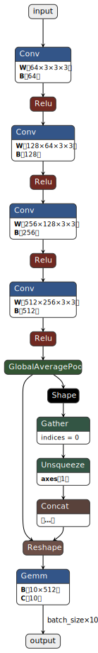

# trex-example

## Introduction

This is an example of TensorRT and [TREx](https://developer.nvidia.com/blog/exploring-tensorrt-engines-with-trex/).

- TensorRT
  - Build engine
  - Profiling
- TREx
  - Visualization

I checked on the following environment.

- reComputer J4012(Jetson Orin NX 16GB)
- JetPack 5.1.2

## Create ONNX model

I created [model/model_bn.onnx](model/model_bn.onnx). This model was generated using the following steps.  
<https://github.com/NVIDIA-AI-IOT/jetson_dla_tutorial>



## Build

Please build engine by TensorRT.

```shell
trtexec --verbose --nvtxMode=verbose --buildOnly --workspace=8192 --onnx=model/model_bn.onnx --saveEngine=model_bn.onnx.engine --timingCacheFile=model_bn.onnx.engine.timing.json --int8 --useDLACore=0 --allowGPUFallback > model_bn.onnx.engine.build.log
```

Please generate meta data of building.

```shell
python3 script/generate_build_metadata.py
```

## Profile

Please profile by TensorRT.

```shell
trtexec --verbose --noDataTransfers --separateProfileRun --useSpinWait --profilingVerbosity=detailed --loadEngine=model_bn.onnx.engine --exportTimes=model_bn.onnx.engine.timing.json --exportProfile=model_bn.onnx.engine.profile.json --exportLayerInfo=model_bn.onnx.engine.graph.json --timingCacheFile=timing.cache > model_bn.onnx.engine.profile.log
```

Please generate meta data of profiling.

```shell
python3 script/generate_profiling_metadata.py
```

## Visualization by TREx

I provided an example notebook([notebook/trex_example.ipynb](notebook/trex_example.ipynb)) for visualization.


## Reference

- <https://docs.nvidia.com/deeplearning/tensorrt/developer-guide/index.html#trtexec-flags>
- <https://github.com/NVIDIA/TensorRT/tree/main/tools/experimental/trt-engine-explorer>
- <https://github.com/NVIDIA-AI-IOT/jetson_dla_tutorial>
